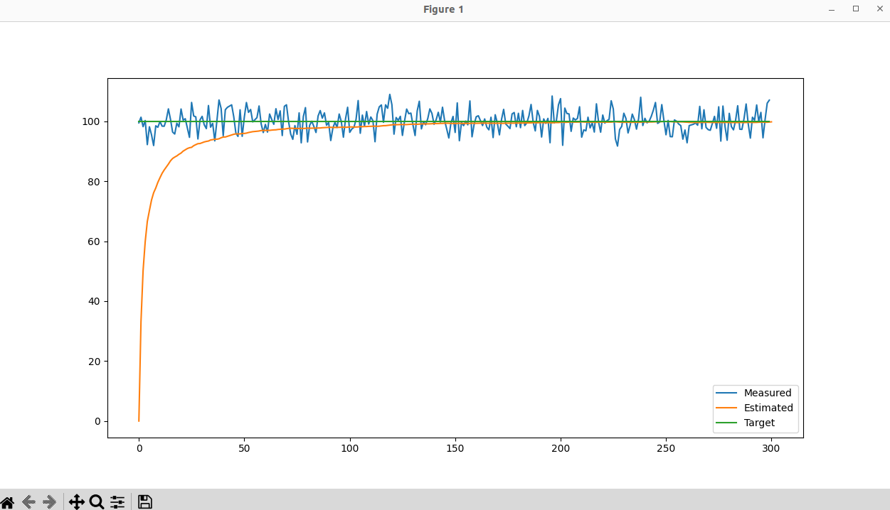
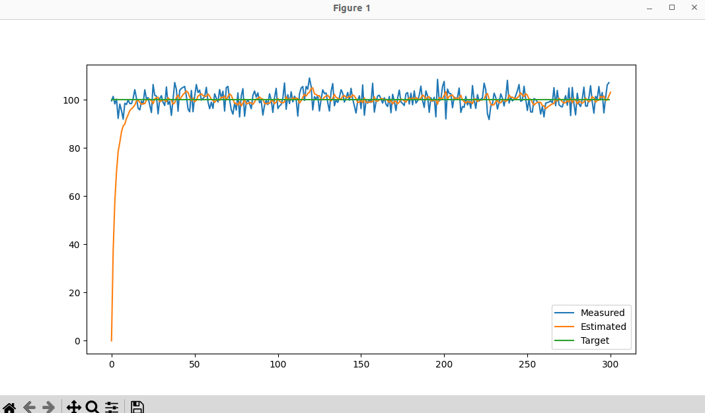
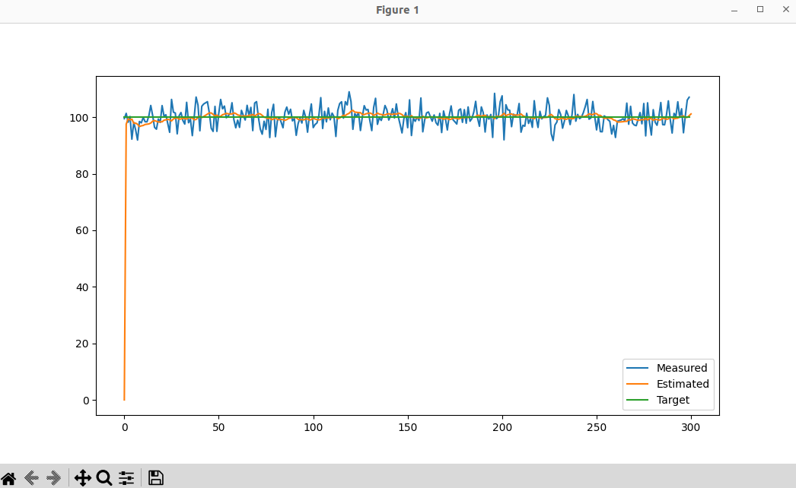

# 卡尔曼滤波作业
## 软件学院 丁利

1. 运行说明
   - 直接运行
    ```cmd
    python KFdemo.py
    ```
   - 查看命令行参数说明
    ```cmd
    python KFdemo.py -h
    ```
2. 不同Q/R矩阵下滤波效果展示
   Q = [0.0001], R = [1]
   
   Q = [0.1], R = [1]
   
   Q = [0.0001], R = [0.01]
   