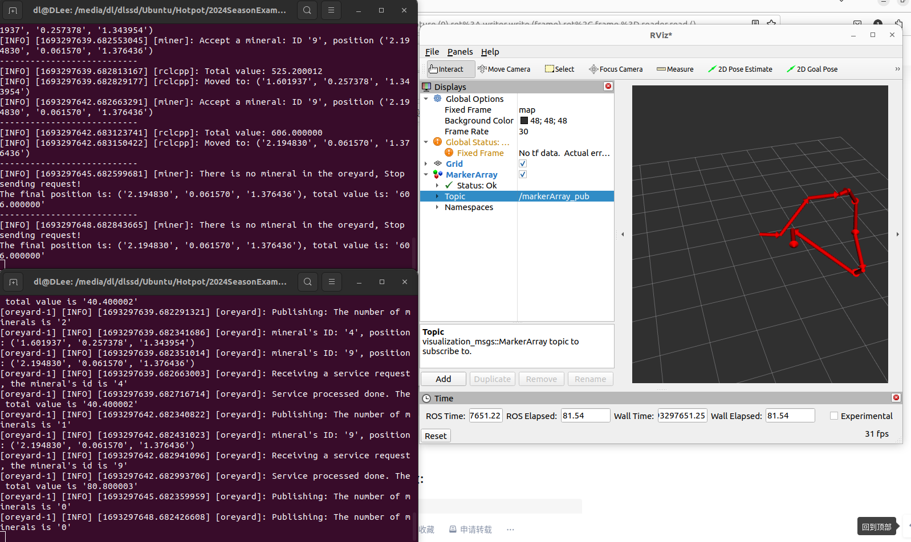
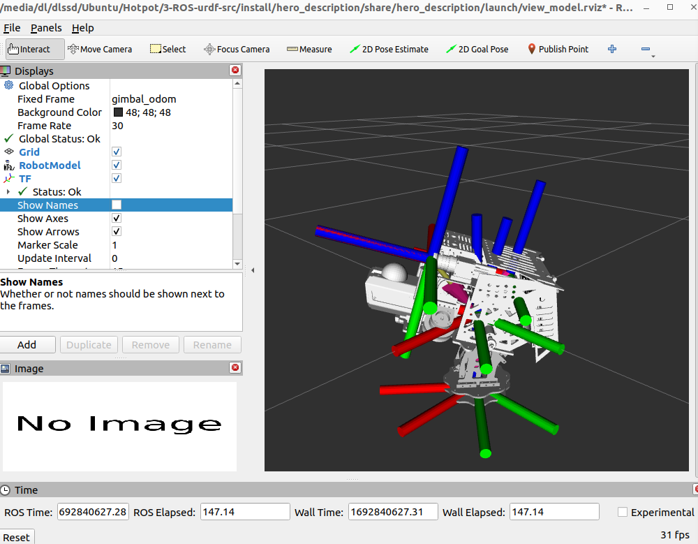
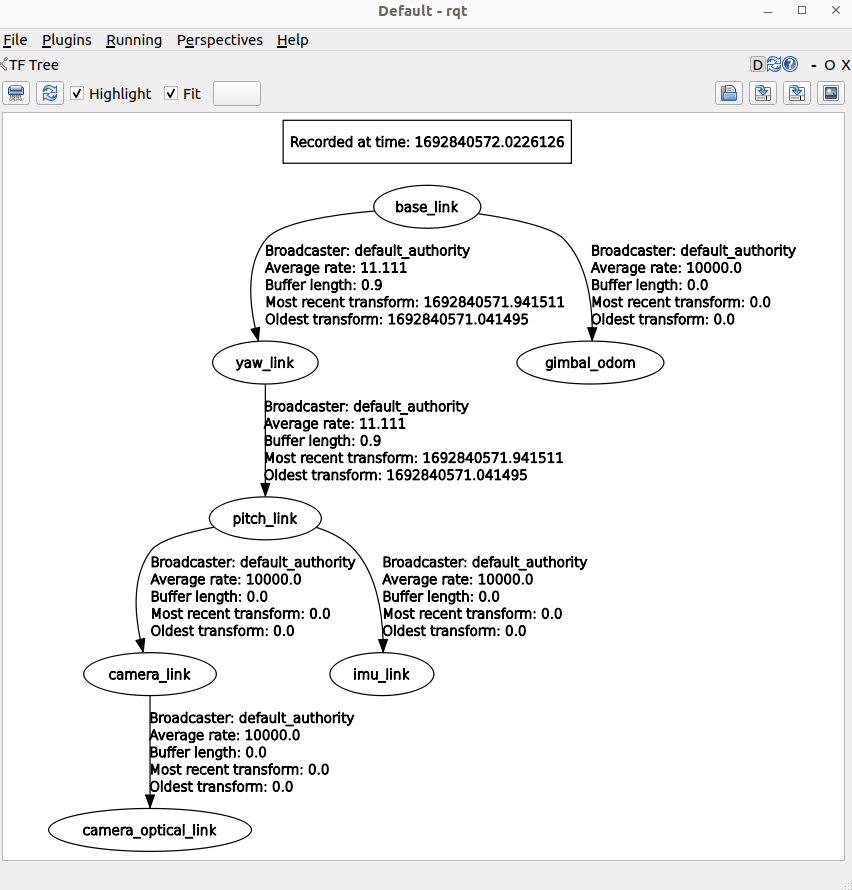
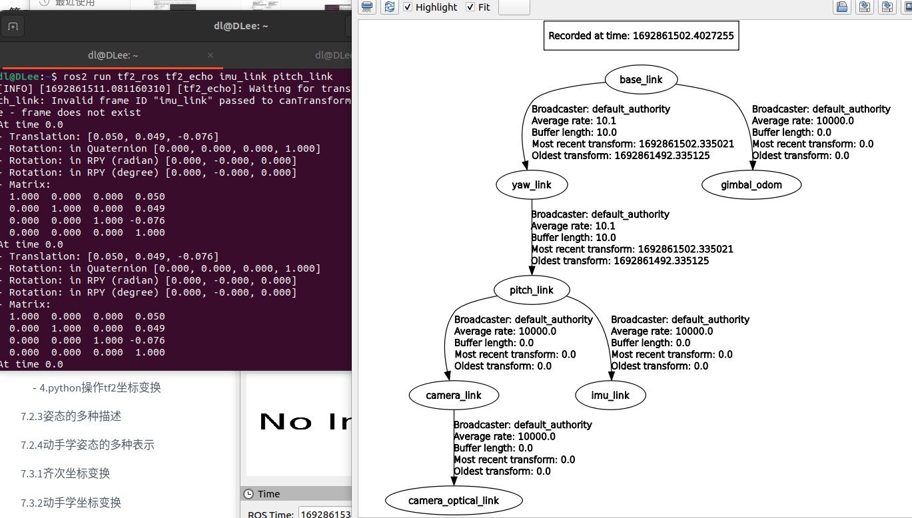
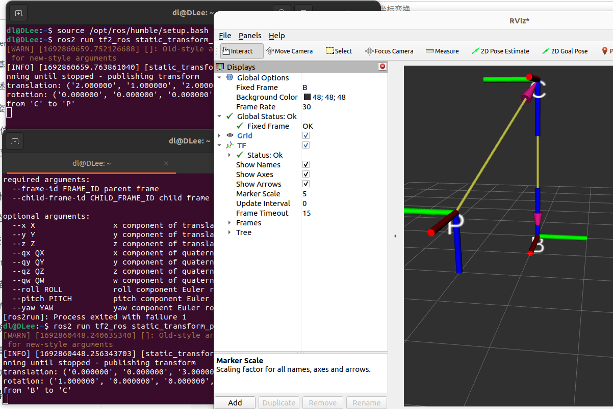

# C++ ROS2和TF2 作业说明

## C++ 作业说明
1. 运行
```cmd
./Cpphw
```
2. 运行说明
</br>按回车键可退出程序，可计算程序运行时间
3. 可拓展性说明：
</br>传入数据可变，传入的函数可变

## ROS2 作业说明
package：
</br>mine_pubsub
</br>my_interfaces
1. 运行环境
```cmd
cd ROSHW_ws
. install/setup.bash
```
2. 运行
</br>分别启动矿脉节点和矿工节点以及rviz2，rviz2添加MarkerArray，订阅makerArray_pub节点以查看可视化路径
```
ros2 launch mine_pubsub mine_pubsub.launch.py
ros2 run mine_pubsub miner
rviz2
```
3. 运行示例


## TF2 作业说明
1. 启动给定的urdf文件



2. 入门tf


3. 代码编写
   1. lookTranform
      - package: learning_tf2_cpp
      - 运行：
      ```cmd
      . install/setup.bash
      ros2 launch hero_description view_model.launch.py
      ros2 run learning_tf2_cpp hero_tf2_listenerr
      ```
   2. tf2_ros::Buffer::transfor
      - package: buffertransform
      - 运行：
      ```cmd
      . install/setup.bash
      ros2 run buffertransform buffertransform 3.0 4.0 5.0 camera_optical_link gimbal_odom
      ```